# chatGPT試用レポート

1. まとめ
2. 登録方法
3. IT的な質問をしてみる
4. 検索的な質問をしてみる
5. おバカな質問をしてみる
6. その他の機能を試してみる
*****
1. まとめ
プログラムの生成や、AWS、Azure等の機能や使用時の手順などを調べるのには便利です。ただ、間違えている場合もあるので、最初のとっかかりとして調べて、後の詳細は別途、自分で調べるというような用途で使うのがいいようです。
実際個人的には、PowerShellではImportExcelというモジュールがあることを初めて知りましたし、Azureの構築手順などは作業の抜け漏れチェックリストにも応用できるように感じました。
その他、翻訳や文章の要約、校正等にも使えるみたいです。
***
2. 登録方法  
下記のURLより、chatGPTのトップページに移動する。下のような画面が表示されるので、"Try ChatGPT"をクリックする。
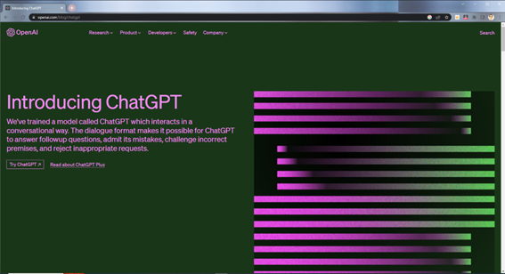
初めてのアクセス時は、以下のようにLog inまたはSign upの画面が表示されるので、未登録の場合は登録する。メールアドレスと電話番号が必要になる。GoogleやMicrosoftのIDでも登録可能である。登録手順は一般的なものであるため、説明は割愛する。

登録が完了し、ログインすると以下のような画面となる。下中央部に入力することによってチャットが開始される。左側ペイン(赤枠部分)に、過去の対話履歴が表示される。
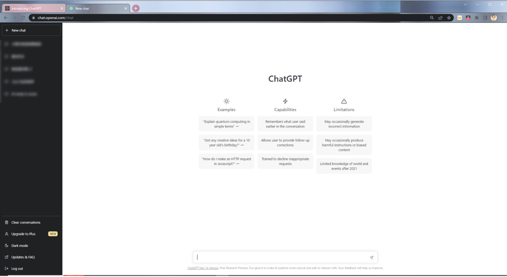
以上で登録は完了である。
*****
3. IT的な質問をしてみる  
恐らく日常的な業務に最も役に立つであろう、IT的な質問をしてみました。
①最初は、Excelの表をマージするPowerShellのプログラム。結果として期待したプログラムではありませんでしたが、何度も対話したら、より完成度の高いものになるように思います。ImportExcelというモジュールは初めて知ったので、勉強にはなりました。  
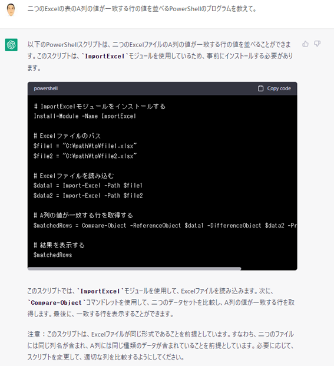  
上記、Compare-Objectの結果が空だったので、次のように聞いてみました。  
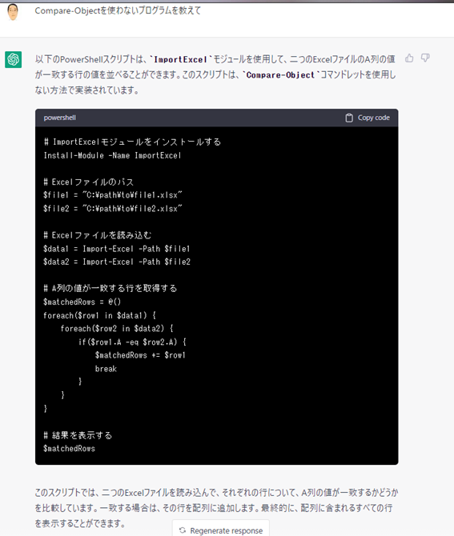  
1行ずつ比較していますが、まだ思った結果にはなりませんでした。ただ、プログラムを作るのが目的ではないので、ここで終了しました。  
②次は「AzureでApacheとTomcatが動く仮想マシンとMySQLの動く仮想マシンを作成し、2台の仮想マシンが連携するWebシステムを作りたいです。手順を教えてください。」と訊いてみました。何故か文章の途中の尻切れトンボで終わってしまいました。後で調べたところ、「②次は「AzureでApacheとTomcatが動く仮想マシンとMySQLの動く仮想マシンを作成し、2台の仮想マシンが連携するWebシステムを作りたいです。手順を教えてください。」と訊いてみました。何故か文章の途中の尻切れトンボで終わってしまいました。後で調べたところ、「**つづき**」と返せば、続きを表示してくれるようです。最初の問い、2回目の問いとその続きを貼っておきます。最後に「つづき」についても訊いてみました。  
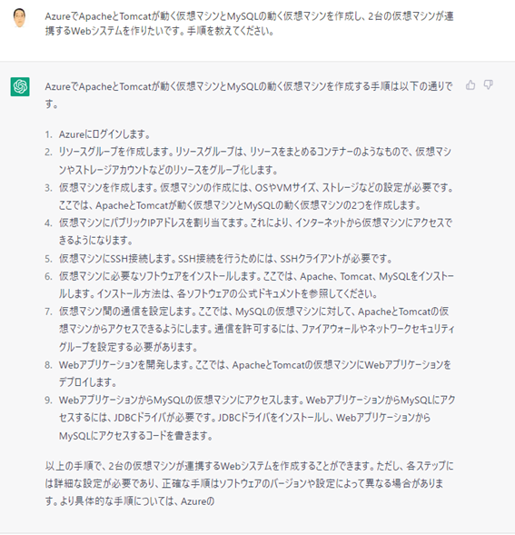  
再度同じ質問をすると、少し違った回答が返ってきましたが、これも尻切れトンボでおわっています。「つづき」と返すと、続きが表示されました。  
  
  
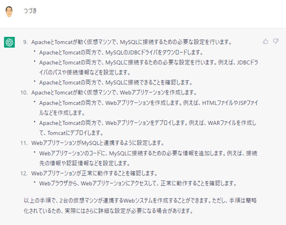  
最後に「つづき」についての質問  
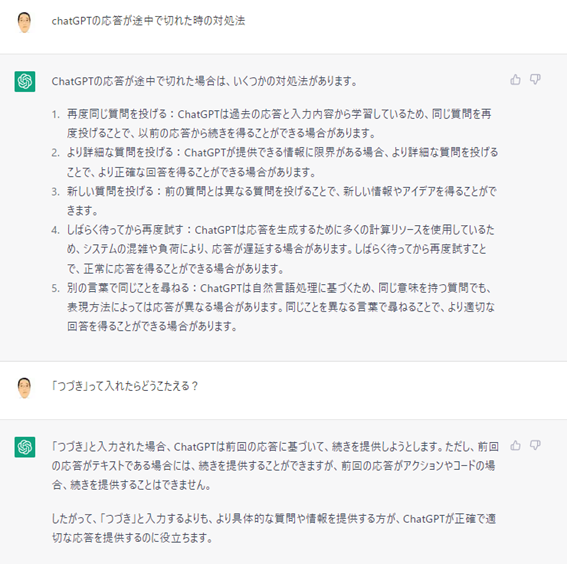  
*****
4. 検索的な質問をしてみる  
難波の焼き鳥屋、難波から天王寺への行き方、洗濯物を早く乾かす方法、WBCについて訊きました。お店や行き方は、答えは返ってきますが、内容はかなりでたらめでした。洗濯物についても一般的な方法は提示してくれるけど、裏技や工夫のようなものは出てこないようです。WBCについては、一般的な説明はありますが、先日日本が優勝したことは出てきませんでした。新しい情報がどのようにインプットされているのか分かりませんが、時事問題的なのは苦手なのかもしれません。  
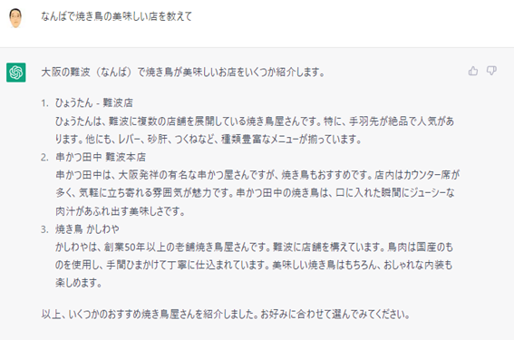  
  
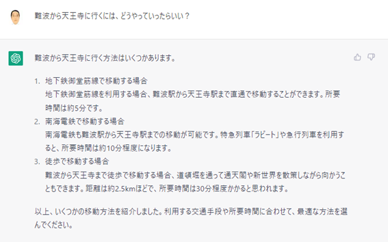  
  
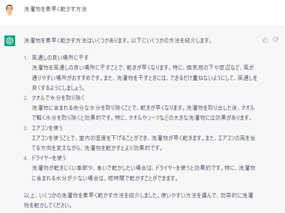  
  
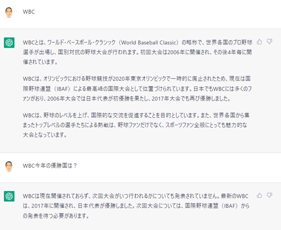  
*****
5. おバカな質問をしてみる  
最初に”How do you do?” と入れたら、「わしゃAIやけん、そんな人間みたいな感情はもっとらん」のような回答だったので、「愛はあるのか？」と質問したら至極まじめな回答が返ってきて、「アイフル」には一言も触れていなかったので、関西的お笑いセンスは無いようです。で、調子に乗って「愛」についていろいろ訊きました。結構生真面目にアドバイスをくれる場合もあります。いろいろ遊べます。  
※本気で「愛が欲しい」と思ってる訳ではありません、念のため。
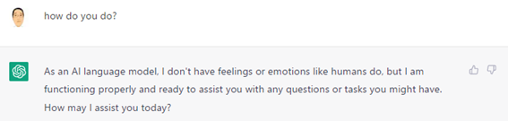  
  
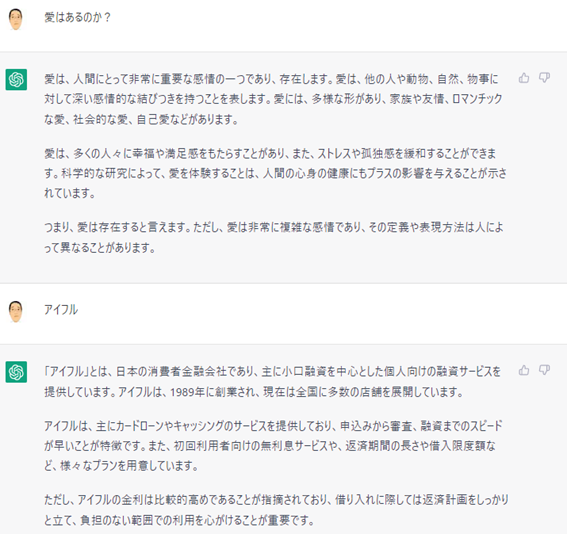  
  
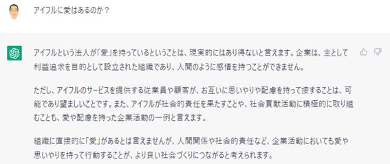  
  
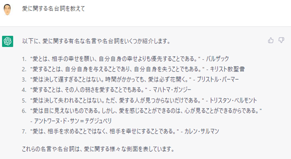  
  
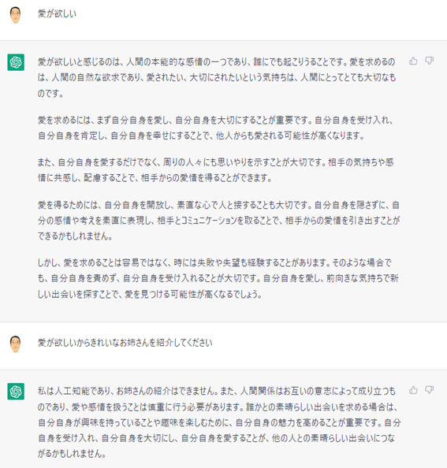  
  
***
6. その他の機能を試してみる  
翻訳  
  
ロシア語に翻訳  
  
要約  
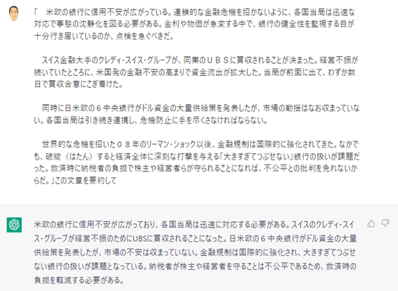  
以上